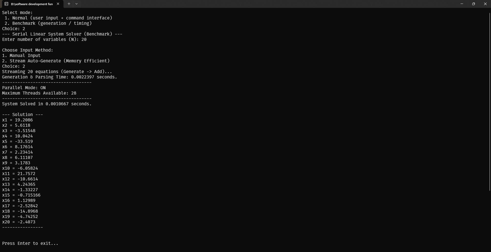

# Linear Equations Solver

A small C++ project that parses and solves systems of linear equations using Gaussian
elimination with partial pivoting.  It also includes a benchmark mode that
can auto-generate large systems for performance testing and optionally uses
OpenMP to parallelize the elimination step.


# Authors
 * Abdelrahman Mahmoud Elsaeed 11206
  
 * Ahmed Adel Eltantawy Atwa 11207
  
 * Mostafa Maged Najdy Mahran 11217
---

## Features

* Interactive command-line interface for entering equations manually.
* `Command` class provides a simple REPL over the current system.
* Benchmark mode supports both manual entry and streaming auto-generation of
  equations via `EquationGenerator`.
* Matrix and vector classes store coefficients; operations are row-based.
* Gaussian elimination with partial pivoting and back substitution.
* Parallel elimination loop uses OpenMP (if enabled at compile time).

---


---

## Screenshots

### UML Diagram – Detailed Model

This UML diagram presents the detailed architecture of the system, including all core components and their relationships such as:

- `LinearSystem`
- `Matrix`
- `Vector`
- `Equation`
- `EquationGenerator`
- `Command`

It reflects the full internal structure of the solver and how objects interact during execution.


---

### UML Diagram – Simplified Model

This UML diagram shows a simplified version of the system design, focusing only on the main structural components required to understand the solver workflow.

It provides a clearer high-level overview without low-level implementation details.


---

### Normal Mode – Example Usage

The following image demonstrates how the program operates in **Normal Mode**, where the user manually enters equations and interacts with the system using commands.


---

### Benchmark Mode – Example Usage

The following image demonstrates the **Benchmark Mode**, including system size input, equation generation (manual or auto-stream), and performance timing output.



---

## Project Structure

```
Linear Equations Solving.cpp    # main entry point, mode selection
Header Files/
  Matrix.h                    # dense row-major matrix template
  Vector.h                    # simple vector container
  LinearSystem.h              # solver logic, equation parsing
  Equation.h                  # parses a single equation string
  EquationGenerator.h         # random equation creation for benchmarks
  Command.h                   # interactive command interpreter
```

### Detailed File Descriptions

* **Linear Equations Solving.cpp** – entry-point containing `main()`. It
  prompts the user to choose between *normal* interactive mode and a
  *benchmark* mode. The latter measures equation generation/parsing and
  solve times and optionally prints the resulting solution.
* **Header Files/Matrix.h** – generic `Matrix<T>` class implementing a
  dynamically sized, row-major 2D array with helper functions such as
  `swapRows`. Used by `LinearSystem` to store coefficients.
* **Header Files/Vector.h** – lightweight vector container with
  operator[] access. Serves for both the constants vector (`B`) and the
  solution vector in `LinearSystem`.
* **Header Files/LinearSystem.h** – templated solver class. Offers
  `addEquation()` which parses a textual equation and populates the
  coefficient matrix & constant vector. Contains the core `solve()`
  implementation performing Gaussian elimination with partial pivoting and
  back substitution. Also provides getters and a `printSolution()` helper.
* **Header Files/Equation.h** – defines an `Equation` type and parsing
  logic. It tokenizes a string like "3x1 + 4x2 = 9" into a list of terms
  with indices and coefficient values, plus the constant term.
* **Header Files/EquationGenerator.h** – utility used only in benchmark
  mode. Randomly produces valid equation strings with integer coefficients
  to stress-test the solver without manual input.
* **Header Files/Command.h** – simple command interpreter wrapping a
  `LinearSystem` instance. Supports commands such as `solve`, `print`,
  `add`, and `exit` for interactive use in normal mode.


---

## Usage

Run the executable and choose one of two modes:

1. **Normal**:
   * Specify number of variables and type each equation in the form
     `3x1 + 4x2 = 9`.
   * After loading, commands such as `solve`, `print`, etc. are available via
     the `Command` interface.

2. **Benchmark**:
   * Enter the system size and select input method:
     * Manual entry (same as normal mode).
     * Stream auto-generate: equations are produced and added one by one while
       timing the parsing step.
   * Solver timing is displayed along with optional solution output for small
     systems.

---

## Algorithm

The solver uses **Gaussian elimination with partial pivoting**:

1. For each pivot row *i* from 0 to *n-1*:
   * Find the row with the largest absolute value in column *i* and swap
     it into the pivot position.
   * Normalize the pivot and eliminate the variable from all rows below.
   * A guided OpenMP `#pragma parallel for` is applied to the elimination loop
     to allow multiple rows to be processed concurrently.
2. Perform back substitution to compute the solution vector.

This method is numerically stable for most well-conditioned systems and
behaves predictably when pivot elements are small.

---

## Complexity

The following table summarizes the costs of each major step.  These figures
are taken directly from the implementation in `LinearSystem` and related
parsing routines:

* `Equation::parse()` tokenizes a string of length ≈ *n* and inserts terms into
a vector, then `LinearSystem::addEquation()` iterates over at most *n* terms
while populating the matrix row.  Each equation therefore costs **O(n)** and
building a full system of *n* equations is **O(n²)** overall.
* The elimination routine contains a triple‑nested loop (outer pivot,
  row‑elimination, column update) yielding **O(n³)** work; the OpenMP pragma
  paralellizes the middle loop but does not alter asymptotic complexity.
* Back substitution performs a double loop over remaining entries, giving
  **O(n²)** time.

| Operation                 | Time Complexity  | Space Complexity                  |
|---------------------------|------------------|-----------------------------------|
| Building/Parsing system   | O(n²)            | O(n²) (matrix) + O(n) (vector)    |
| Gaussian elimination      | O(n³)            | –                                 |
| Back substitution         | O(n²)            | –                                 |

*Memory* is dominated by the `n × n` coefficient matrix and a handful of
vectors, so overall **O(n²)** space.  Equation generation used in benchmark
mode adds O(n) per equation but remains subsumed by matrix storage.

---

## Notes

* The code assumes well-formed input; malformed equations may produce
  undefined behavior or parsing errors.
* OpenMP support requires compiling with `-fopenmp` (GCC/Clang) or equivalent
  flags.
* The `EquationGenerator` is intended only for benchmarking and produces
  equations with random integer coefficients.

Feel free to extend the project with additional features such as matrix
input from files, support for under/overdetermined systems, or alternative
solvers.